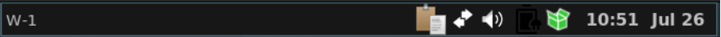

# MX Fluxbox - Frequently Asked Questions Manual

## What is MX Fluxbox?

MX Fluxbox uses the [window manager](https://en.wikipedia.org/wiki/Stacking_window_manager) Fluxbox. MX Fluxbox offers MX Linux users an alternative desktop epxerience from the default desktop environment used by MX Linux, XFCE. Although Fluxbox is not a full desktop environment, MX Fluxbox adds features to enhance the functionality and ease of use for MX Linux users that are not normally present in a default install of the window manager Fluxbox. These enhancements and instructions on how to customize MX Fluxbox are explained in this FAQ styled manual. For a history and overview of Fluxbox, consult the [Wikipedia](https://en.wikipedia.org/wiki/Fluxbox). 

## How do I check out MX Fluxbox?

In MX Linux versions 19.2 and later, MX Fluxbox has already been installed. If you are currently viewing this manual from the default MX Linux desktop environment of XFCE, you will need to "Log Out."

At the login screen you will see an icon in the middle at the top of the screen. Click on that icon and you will see "MX Fluxbox" as one of the options. Choose that option and enter your user's password to log into the MX Fluxbox environment.

You should see a screen similar to what is displayed below.

- Use the desktop menu: right-click anywhere on the desktop. This menu is restricted to 1) common apps, 2) fluxbox settings and 3) session actions. It is set by ~/.fluxbox/menu-mx. 
- Use the default toolbar at the top.
- The user can see the entire MX-Xfce Application Finder by clicking “All apps” in the desktop menu, pressing F6, or clicking the MX Linux icon on the top of the dock on the left side of the screen.

## What is the toolbar across the top?

This fluxbox toolbar offers MX users information about workspaces, open applications, a system tray, and the current time. Its width and placement can be set with the options available by middle-clicking (=scroll wheel) the clock or pager on the toolbar—if that doesn’t work for some reason, click Menu > Settings > Window, slit and toolbar > Toolbar. Height is set in ~/.fluxbox/init/ :

session.screen0.toolbar.height:   0	

If a zero is there, it means that the selected style will set the height. Otherwise, a value of 20 to 25 is often comfortable.

The toolbar contains the following default components (L-R):

- pager 

Allows you to switch workspace up (right click) or down (left click); same as Control + F1/F2/ etc., Ctrl-Alt + ←/→ or using the scroll wheel over an empty section of the desktop. Number and name are set in the ~/.fluxbox/init. “W” stands for “Workspace.”

- iconbar 

Here open apps will show an icon, with various window options available by right-clicking the relevant icon (including the toolbar itself) > iconbar mode.  Default for MX-Fluxbox is All Windows. 

- systemtray AKA systray

Equivalent of Notification Area in Xfce. Default components set in ~/.fluxbox/init; apps that have a systemtray option will show there when launched.  

- clock 

To adjust the clock to 12h or 24h, right-click and click 12h or 24h, whichever shows. If that doesn’t work, select "Edit clock format." 
-- 24h: %H:%M, 12h: %I:%M.
-- The default is 12h time and date in day/short month format: %I:%M  %b %d. Many other time/date options are available: https://mxlinux.org/wiki/other/time-formats-in-scripts/ 

You can move or delete any of the toolbar components in ~/.fluxbox/init/ , which by default are set up in this way:

	workspacename, iconbar, systemtray, clock 

